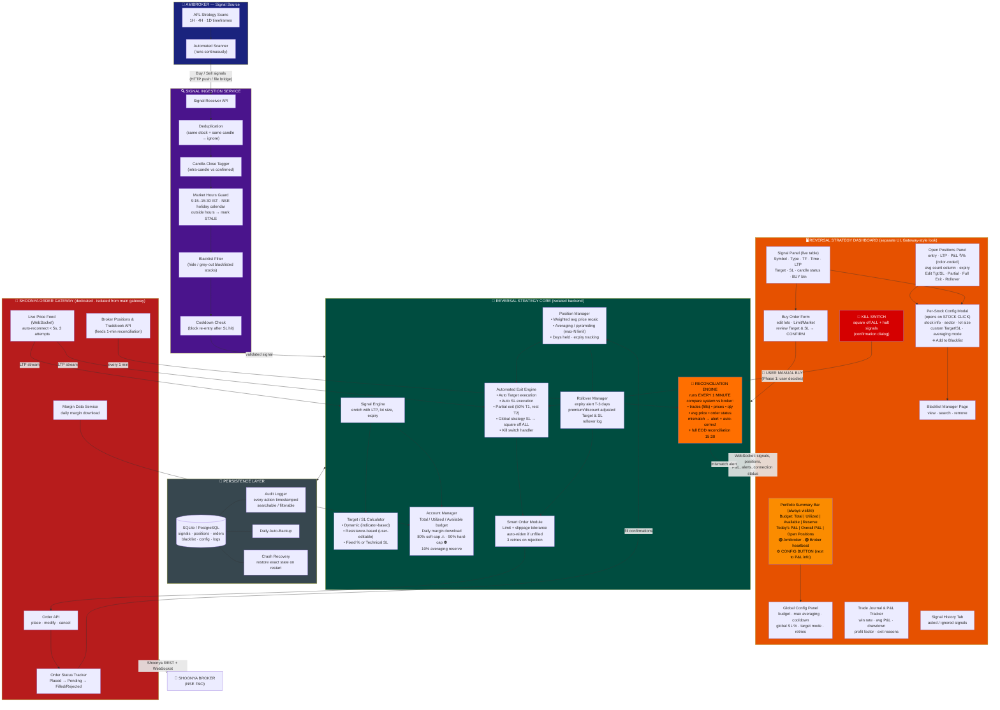
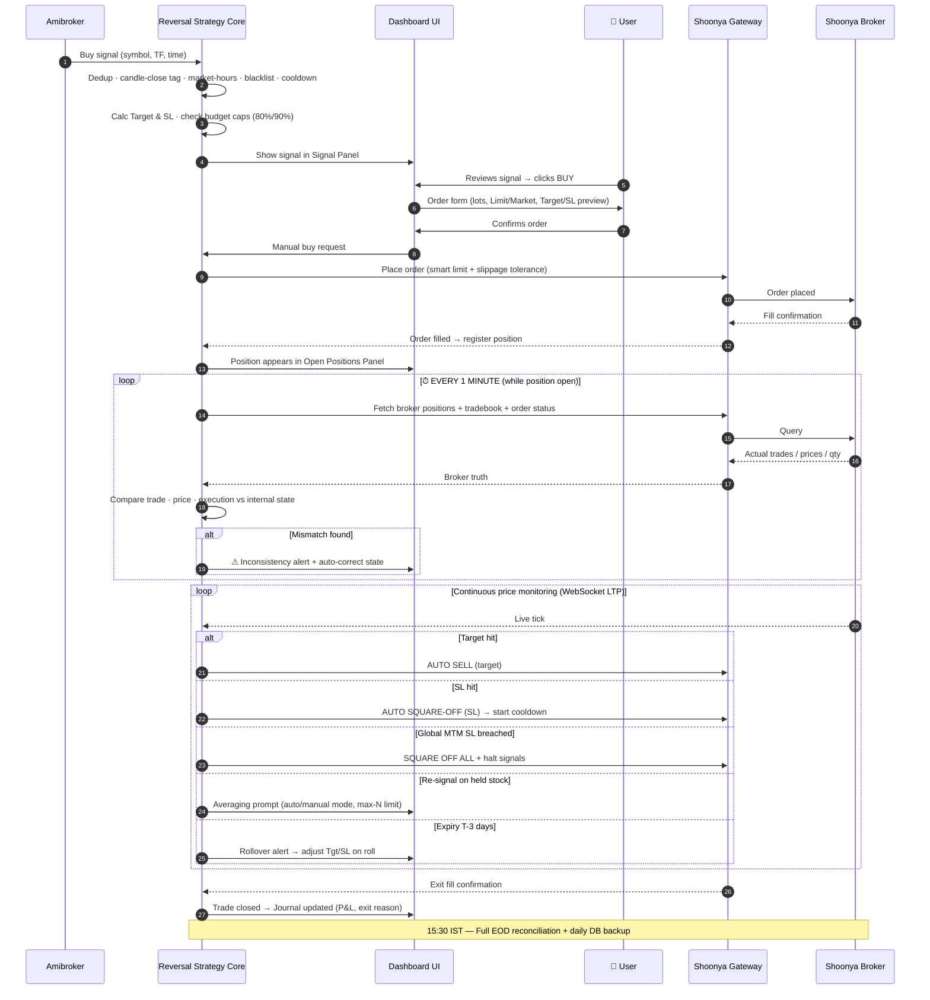

# Reversal Strategy — System Architecture & Pipeline

Strategy module: **Reversal Strategy**
Phase 1: Auto signals → Manual Buy → Fully-automated exits.
The Shoonya order gateway is a **dedicated instance for this strategy**, completely isolated from the main trading gateway at `/Users/mac/gateway_system/Gateway` (that codebase is only reused as the UI/gateway template).

> **v2 deltas (see REQUIREMENTS §0):** closed-candle signals only (no candle-status) + Search & Add · per-buy MANUAL/AUTO Target & SL (ATR / resistance) with ₹ projection · LIMIT-only orders · **Target → Trailing SL** (not sell-at-target) · no post-SL cooldown · reserve = 100 − hard cap · budget on SPAN margin · Shoonya via isolated REST/WS gateway · Amibroker via CSV-bridge webhook · white UI.

---

## 1. Full System Architecture (End-to-End Pipeline)

---

## 2. Trade Lifecycle (Sequence — signal to exit, with 1-minute reconciliation)

---

## 3. Key UI placement rules (as specified)

| Element | Placement |
|---|---|
| ⚙️ Config (global settings) button | Top bar, directly beside the P&L / budget information |
| Per-stock configuration | Modal that opens when the user **clicks a stock** (in Signal Panel or Positions Panel) — includes stock info, custom Target/SL, averaging mode, and Add-to-Blacklist |
| 🔴 Kill Switch | Always visible, prominent, confirmation dialog |
| Averaging trades | Separate clearly-identifiable column (count + new avg price) |
| Budget Exhausted (≥90%) | Buy button hidden, badge shown — signals still visible |

## 4. Isolation guarantee

- **Reversal Strategy backend + its Shoonya gateway** run as their own processes with their own DB — a crash in the main Gateway (`/Users/mac/gateway_system/Gateway`) cannot affect this strategy, and vice-versa.
- The existing Gateway codebase is used **only as the visual/structural template** for the new UI and the Shoonya order-placement layer.

## 5. Phase 2+ (already accommodated in the architecture)

Auto-buy toggle · automated blacklisting plug-ins · multi-strategy budgets · paper-trading mode · multi-broker adapters · advanced analytics.
